## Sweet-Mart (E-Shop Application)

Sweet Mart is a complete E-Shop application through which customers can buy sweets online.
Using this application, customers/users can view blogs and products, share thier review about it (blog comments and product review), add, edit and modify cart items (products) and checkout after entering delivary address and completing payment.
Customer authentication is done using *Django Authentication*. Database used is *SQLite3* which is django's default database. Payment Gateway used is *Razorpay*.

### 🔗 Content

* [Overview](#sweet-mart-(e-shop-application))
* [Content](#-content)
* [Features](#-features)
* [Tech Stack](#-tech-stack)
* [Environment Variables](#-environment-variables)
* [Run Locally](#-run-locally)
* [Documentation](#-documentation)
* [Demo](#-demo)
* [Screen-Shots](#-screen-shots)
* [Author](#-author)


### 📋 Features

- **USER AUTHENTICATION :** Users can Signup for a new account, Verify thier email id, Login using email and password, make a Forgot request to reset thier password.

- **PRODUCTS AND BLOGS :** Users can view all products and blogs.

- **REVIEWS AND RATING :** User can add blogs comments, product review and rateings.

- **CONTACT US FORM :** User can fill up the Contact Us form. (Auto Corrospondence email sending feature)

- **CART FUNCTIONALITY :** User can add and remove products from cart. Users can also change the quantity of items in thier cart.

- **PAYMENT GATEWAY :** Users can make payment using Net-Banking, UPI, Card Payments, etc. through Razorpay Payment Gateway which is integrated in the system.

- **AUTO INVOICE :** After payment, users would recieve invoice (auto-generated) in thier mailbox.


### 🧰 Tech Stack

- **`BACKEND`** : Django *(Python)*

- **`DATABASE`** : SQLite3

- **`FRONTEND`** : HTML, CSS, Javascript


### 🔐 Environment Variables

To run this project, you will need to add the following environment variables to your **.env** file

- `EMAIL_ID`  -  Email ID (which would be used to send emails)

- `EMAIL_PW`  -  Email Password

- `PUBLIC_KEY` - Razorpay API Public Key

- `PRIVATE_KEY` - Razorpay API Private Key

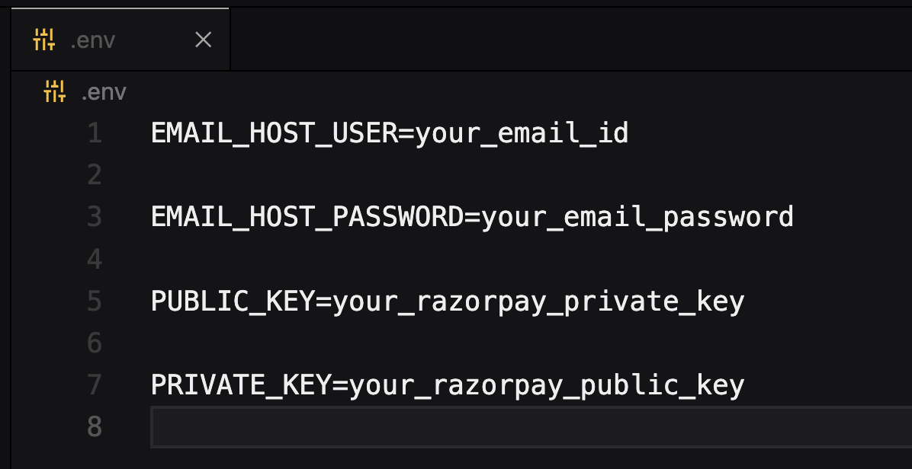


### 💻 Run Locally

***Step#1 : Clone Project Repository***

```bash
git clone https://github.com/atharvparkhe/sweet-mart.git && cd sweet-mart
```

***Step#2 : Create Virtual Environment***

* If *virtualenv* is not istalled :
```bash
pip install virtualenv && virtualenv env
```
* **In Windows :**
```bash
env/Scripts/activate
```
* **In Linux or MacOS :**
```bash
source env/bin/activate
```

***Step#3 : Install Dependencies***

```bash
pip install --upgrade pip -r requirements.txt
```

***Step#4 : Add .env file***

- ENV file contents
    - **In Windows :**
    ```bash
        copy .env.example .env
    ```
    - **In Linux or MacOS :**
    ```bash
        cp .env.example .env
    ```
- Enter Your Credentials in the *".env"* file. Refer [Environment Variables](#-environment-variables)

***Step#5 : Run Server***

```bash
python manage.py runserver
```

*Check the terminal if any error.*


### 📄 Documentation

The docs folder contain all the project documentations and screenshots of the project.

**Local Server Base Link :** http://localhost:8000/

**Admin Pannel Access :**
- ***Email :*** "admin@admin.com"
- ***Password :*** "password"


### 🧑🏻‍💻 Demo


YouTube Link : https://youtu.be/CZClbyfqftY


### 🌄 Screen-Shots

- **Home Page**
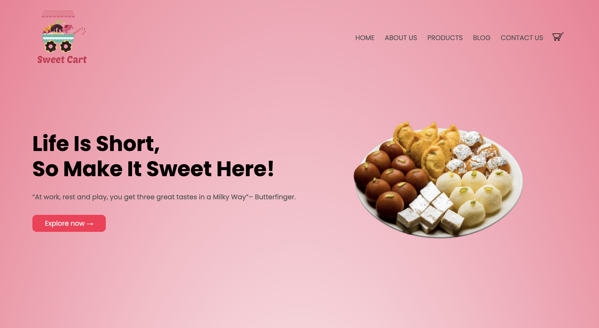


- **Authentication**
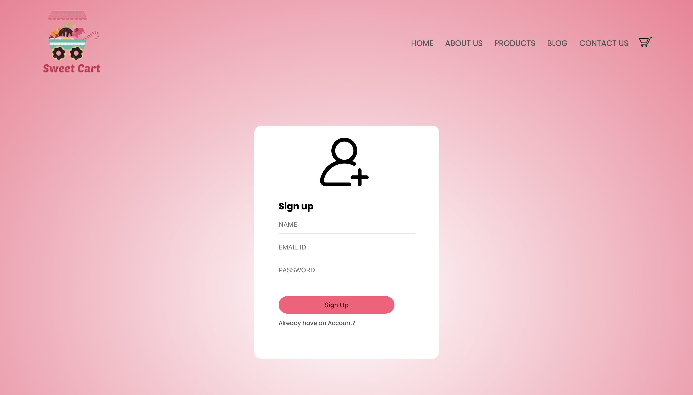

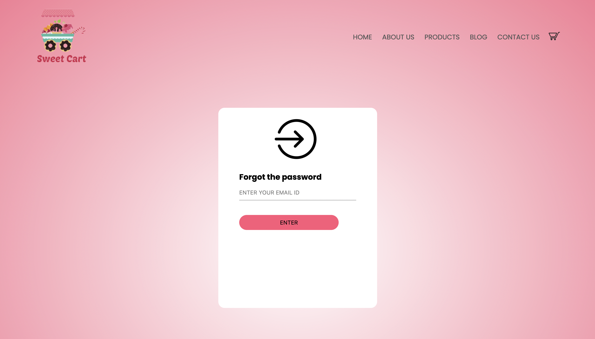
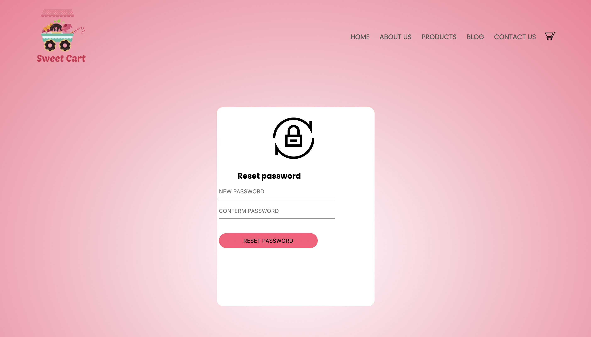

- **Blogs**

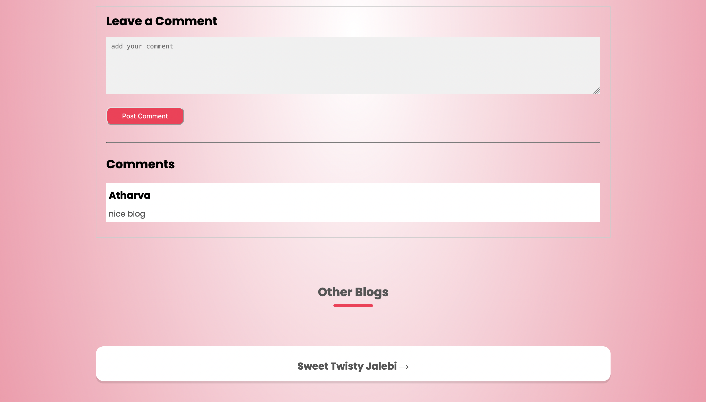

- **Product**


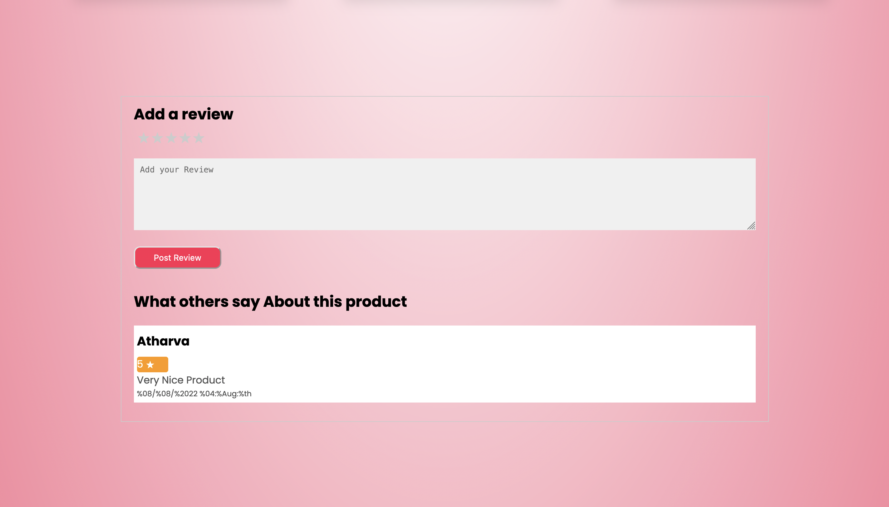

- **Cart**
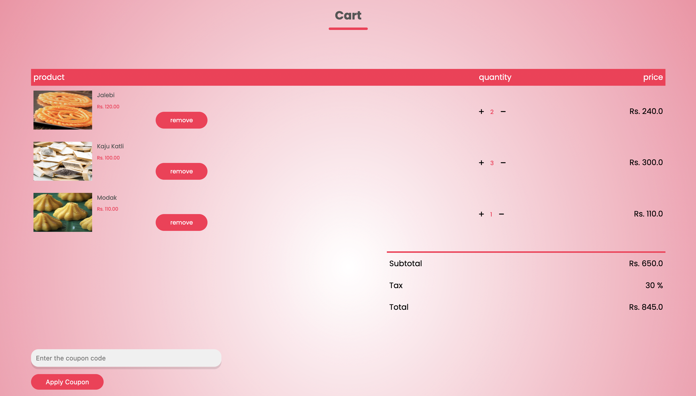
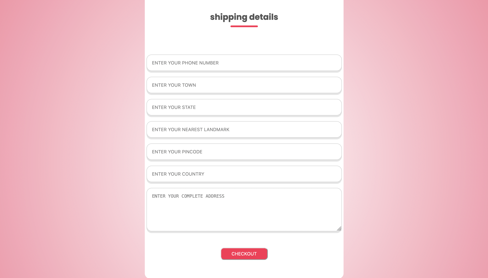
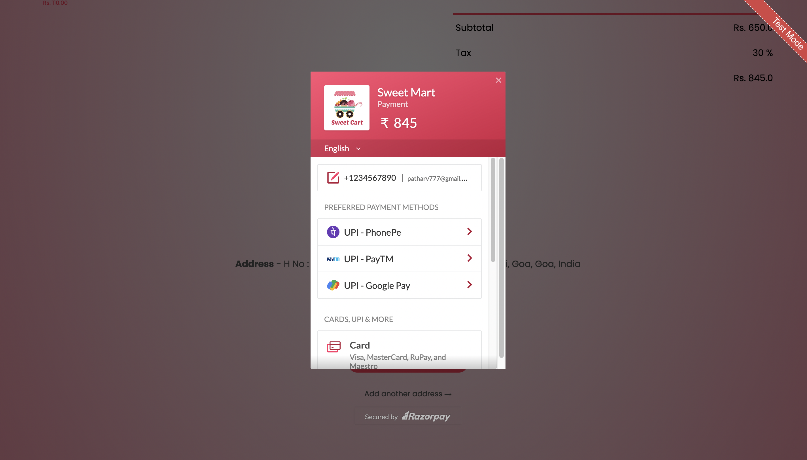
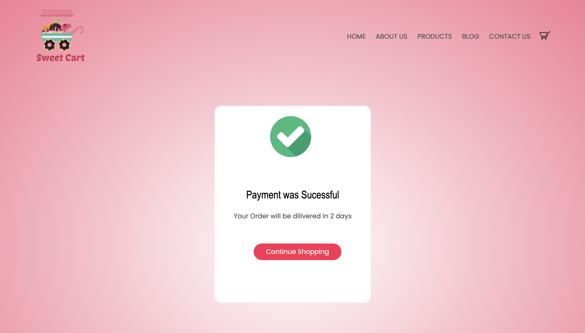
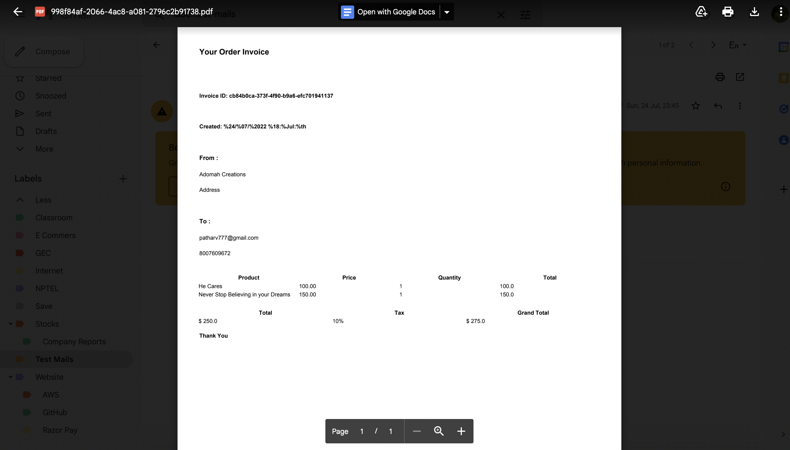


### 🙋🏻‍♂️ Author

**🤝 Connect with Atharva Parkhe**

[](https://www.linkedin.com/in/atharva-parkhe-3283b2202/)
[](https://www.github.com/atharvparkhe/)
[](https://www.twitter.com/atharvparkhe/)
[](https://www.instagram.com/atharvparkhe/)
[](https://leetcode.com/patharv777/)
[](https://www.youtube.com/channel/UChimOJO64hOqtE7HCgtiIig)
[](https://discord.gg/8WNC43Xsfc)
